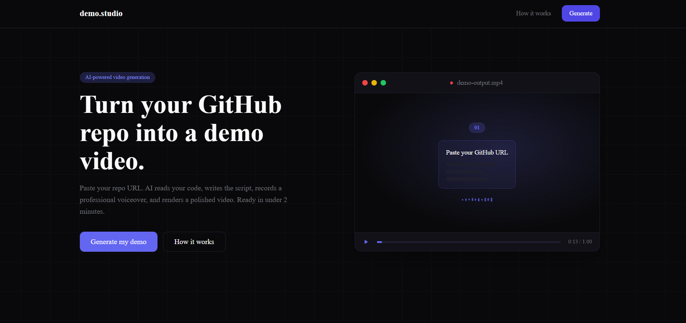

# demo.studio

Turn any GitHub repository into a polished demo video in minutes without recording, editing, or writing a script yourself.

Most developers never create demo videos for their projects not because demo videos don't matter, but because making them takes too much time.

demo.studio automates the entire process:

- reads your repository
- understands what your project does
- writes a narration script
- generates a realistic voiceover
- renders a ready-to-share MP4

Perfect for launches, hackathons, portfolios, investor demos, and social posts.

Paste a GitHub URL → get a demo video back.

[Live Demo](https://demo-studio-mu.vercel.app/)

---

## Why This Exists

A strong project with a weak presentation usually gets ignored.

Most repos look like this:
- decent code
- decent README
- zero demonstration

And that's a problem because people rarely install random repos just to understand them.

Video communicates faster than documentation:

users instantly understand the product
recruiters see execution
judges understand hackathon projects faster
Product Hunt visitors actually stop scrolling

But making a good demo video normally requires:

- scripting
- screen recording
- editing
- voiceover work
- rendering
way too much time

So most developers skip it entirely.

demo.studio exists to remove that bottleneck.

---

## What demo.studio Actually Does

You give it a public GitHub repository.

It:

- analyzes the codebase
- understands the project structure
- generates a human-style narration script
- creates an AI voiceover
- assembles visuals + audio into a video
- exports a shareable MP4

No editing. No voice recording. No timeline tweaking.

---

## Features

1. Repo-Aware Script Generation

The AI doesn't generate generic filler.

It reads:
- your README
- dependencies
- project structure
- key files

Then creates a narration that explains what your project actually does.

2. Automatic Voiceover

Uses ElevenLabs to generate realistic narration automatically.
- No microphone needed.
- No awkward self-recording.
- No audio cleanup.

3. One-Click Video Rendering

The app assembles:

- narration
- screenshots/assets
- motion backgrounds
- timing
- transitions

into a ready-to-share MP4.

Useful for:
- Product Hunt launches
- Twitter/X posts
- portfolio showcases
- startup demos
- hackathon submissions
- Fast Enough to Actually Use

Most demo workflows take hours.
This takes minutes.

That changes behavior completely. Developers are far more likely to create demos when the cost drops close to zero.

---

## How it works

1. **Paste your repo URL** - any public GitHub repo works
2. **AI reads your code** - analyzes the file structure, 
   README, and dependencies to understand what you built
3. **Script is written** - a natural, conversational 
   narration is generated automatically
4. **Voice is recorded** - ElevenLabs turns the script 
   into a professional voiceover
5. **Video is rendered** - your screenshots, voice, 
   and background are assembled into an MP4

## Tech Stack

| Technology                                                      | Purpose               |
| --------------------------------------------------------------- | --------------------- |
| Next.js                                                         | Frontend + API routes |
| [v0.dev](https://v0.dev?utm_source=chatgpt.com)                 | UI generation         |
| [Groq](https://groq.com?utm_source=chatgpt.com) + Llama 3.3 70B | Script generation     |
| [ElevenLabs](https://elevenlabs.io?utm_source=chatgpt.com)      | Voice synthesis       |
| FFmpeg                                                          | Video rendering       |
| GitHub API                                                      | Repository analysis   |
| [Vercel](https://vercel.com?utm_source=chatgpt.com)             | Deployment            |

---

## Running locally

1. Clone the Repository

git clone https://github.com/faintstack/Demofy

cd Demofy

2. Install Dependencies

npm install

3. Configure Environment Variables

Create a .env.local file:

GITHUB_TOKEN=your_github_token
GROQ_API_KEY=your_groq_key
ELEVENLABS_API_KEY=your_elevenlabs_key
ELEVENLABS_VOICE_FEMALE=your_female_voice_id
ELEVENLABS_VOICE_MALE=your_male_voice_id

4. Start the Development Server

npm run dev

Open [localhost:3000](http://localhost:3000).

---

## Getting API keys

| Service | Free tier | Link |
|---|---|---|
| GitHub Token | Yes | github.com/settings/tokens |
| Groq | Yes | console.groq.com |
| ElevenLabs | Yes (limited) | elevenlabs.io |

---

## Real World Use Cases
1. Hackathons
- Most hackathon projects loose during presentation round.

- Teams build an interesting technical project but fails to present it well.

- A clean auto generated demo instantly improves:
clarity
presentation quality
perceived polish

2. Indie Hackers & Launches
- Shipping consistently matters more than perfection.

- If creating demo videos becomes frictionless, developers are far more likely to market what they build.

3. Portfolio Projects
- Recruiters and clients rarely clone repos.
- But they will definately watch a 45 second demo.

4. Open Source Maintainers
Good demos help contributors quickly understand:

- what the project does
- why it matters
- how it works

That makes the project easier to understand and contribute to.

---

## What's next

- Fully autonomous demo generation from a deployed app URL, the agent navigates the product itself, understands flows, captures scenes dynamically, and generates the video automatically
- More voice styles and accents
- Animated visual themes
- GitHub Chrome extension: "Generate Demo” directly from any repo page 
- API access for CI/CD pipelines
- Better scene generation from frontend structure

---